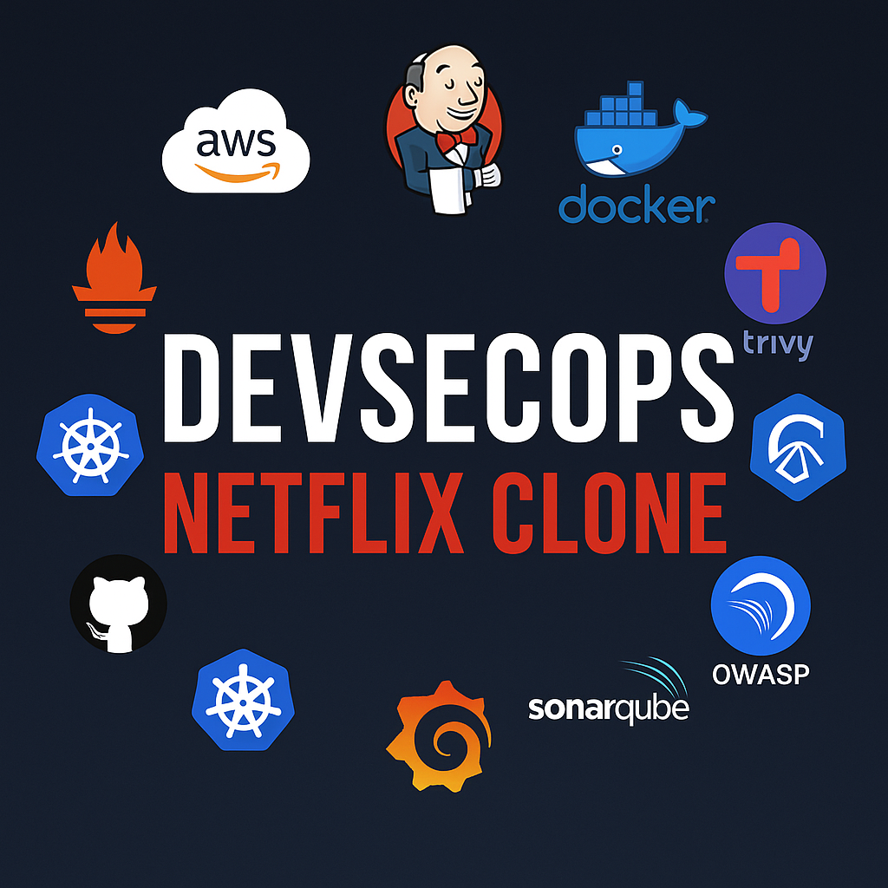

  
   

 

##### **Youtube Video for step by step Demonstration!**

# Deploy Netflix Clone on Cloud using Jenkins - DevSecOps Project!

> This repository is a **forked version** of the original DevSecOps project by [N4si](https://github.com/N4si).
> 
> I used this project for training and learning purposes, and plan to experiment with CI/CD, security tools, and deployment processes.
>
> Original project: [N4si/DevSecOps-Project](https://github.com/N4si/DevSecOps-Project)

---

## My Experiments and Changes:

- ✅ Practiced running Jenkins pipeline locally
- 🔐 Added Trivy security scanning integration
- 🐳 Customized Dockerfiles for personal use

Code → Commit → Jenkins → Build → Scan → Deploy

